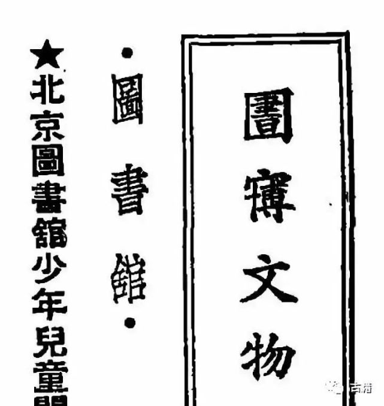

<!-- START doctoc generated TOC please keep comment here to allow auto update -->
<!-- DON'T EDIT THIS SECTION, INSTEAD RE-RUN doctoc TO UPDATE -->
**Table of Contents**  *generated with [DocToc](https://github.com/thlorenz/doctoc)*

- [Chinese Characters Missing from Unicode](#chinese-characters-missing-from-unicode)
  - [⿱成龍 and ⿱成龙](#%E2%BF%B1%E6%88%90%E9%BE%8D-and-%E2%BF%B1%E6%88%90%E9%BE%99)
  - [简体字 von 嗧 (jialun) fehlt](#%E7%AE%80%E4%BD%93%E5%AD%97-von-%E5%97%A7-jialun-fehlt)
  - [𠏹](#%F0%A0%8F%B9)
  - [Variant of 錢](#variant-of-%E9%8C%A2)
  - [⿱宀博 for 博物館](#%E2%BF%B1%E5%AE%80%E5%8D%9A-for-%E5%8D%9A%E7%89%A9%E9%A4%A8)

<!-- END doctoc generated TOC please keep comment here to allow auto update -->

<!-- # **NO LONGER USED; MIGRATED TO MINGKWAI-TYPESETTER-TEXTS/ISSUES ### -->

# Chinese Characters Missing from Unicode

## ⿱成龍 and ⿱成龙

⿱成龍 and ⿱成龙 (py duang1) as of http://languagelog.ldc.upenn.edu/nll/?p=17913#comment-1491798

## 简体字 von 嗧 (jialun) fehlt

## 𠏹

similar chr:
&#x203f9;	𠏹	<3212522125112141>
&#x203f9;	𠏹	⿰亻⿱覀国

⿰亻⿱覀國
variant of 佛仏

佛, ⿰亻⿱覀國: ,,From man and <i>not</i>; the second
ideographic form meaning the <i>man</i> of the <i>west country</i>, is used
only by priests.‘‘

p153c2
&wells-sdcl-1903#153205;
(schema is ...pppcnn, where p is page nr, c is column nr, and nn is zero-padded number of main entry character)

this edition reprint 1903 (microsoft scan; University of California; 712b / W72 / 1903)

Williams, Samuel Wells: A Syllabic Dictionary of the Chinese Language: Arranged According to the Wu-Fang Yuen Yin, with the Pronunciation as Heard in Peking, Canton, Amoy, and Shanghai 1874 (Set. Western Linguists and the Languages of China Series.)
Author: Williams, Samuel Wells
Title: A Syllabic Dictionary of the Chinese Language: Arranged According to the Wu-Fang Yuen Yin, with the Pronunciation as Heard in Peking, Canton, Amoy, and Shanghai 1874 (Set. Western Linguists and the Languages of China Series.)
Year: 2001
Publisher: Ganesha Publishing
Place of publication: Bristol

## Variant of 錢

Variant of 錢 shown in Mathew's; strokeorder presumably <324>, ⿰亻丶 (other,
more cursive forms are also attested)

## ⿱宀博 for 博物館

⿱宀博

> This character is not encoded in Unicode currently, it is represented by Ideographic Description Sequences
> and rendered dynamically. [...]
> 意為博物館—[*zi.tools*](https://zi.tools/zi/%E2%BF%B1%E5%AE%80%E5%8D%9A?secondary=ids&seq=%E2%BF%B1%E5%AE%80%E5%8D%9A)

> 圖書館又稱圖書舘，在中國大陸舘被當做館的異體字,已極少使用。
>
> 圖書館亦稱圕，即囗裡面一個書，一個字讀三個音：「圖書館」，屬於合字。近代圖書館學家杜定友（1898年-1967年）
> 曾於1924年創「圕」字來代替「圖書館」一詞，於當時中日學術文化界也曾流行一時。至今中華民國教育部仍有
> 「金圕獎」，以表揚優良圖書館。1926年，日本雜誌《圕》以「圕」字命名，杜定友對《圕》第一期所有文章中
>「圕」字的使用情況加以統計，統計結果是──該刊用「圕」字436次，如用舊例「圖書館」則須用1308字。圕在中
> 國大陸貴州財經大學圖書館內仍被使用。
>
> 藏經閣：在古代中國，圖書館多與佛教有關，不過當時並不叫圖書館，而是叫藏經閣。—[*圖書館*](https://zh.wikipedia.org/zh-tw/图书馆)

* [*圕 - iFuun*](http://www.ifuun.com/a2019063019876941/)
* http://www.ifuun.com/a2019063019876941/
* http://i1.wp.com/inews.gtimg.com/newsapp_bt/0/9524998867/641

