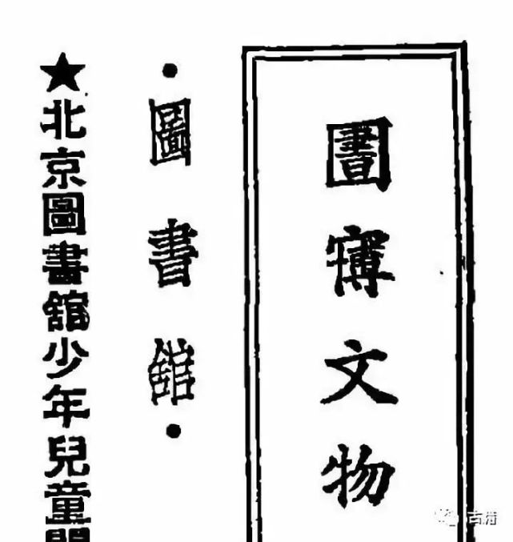
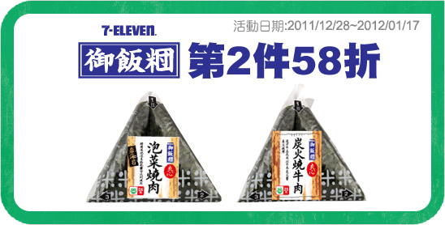
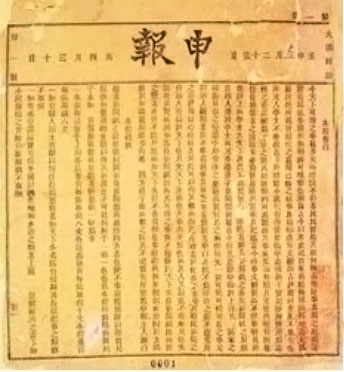

# Chinese Characters Missing from Unicode

<!-- START doctoc generated TOC please keep comment here to allow auto update -->
<!-- DON'T EDIT THIS SECTION, INSTEAD RE-RUN doctoc TO UPDATE -->
**Table of Contents**  *generated with [DocToc](https://github.com/thlorenz/doctoc)*

- [⿱成龍 and ⿱成龙](#%E2%BF%B1%E6%88%90%E9%BE%8D-and-%E2%BF%B1%E6%88%90%E9%BE%99)
- [简体字 von 嗧 (jialun) fehlt](#%E7%AE%80%E4%BD%93%E5%AD%97-von-%E5%97%A7-jialun-fehlt)
- [𠏹](#%F0%A0%8F%B9)
- [Variant of 錢](#variant-of-%E9%8C%A2)
- [⿱宀博 for 博物館](#%E2%BF%B1%E5%AE%80%E5%8D%9A-for-%E5%8D%9A%E7%89%A9%E9%A4%A8)
- [⿺麥方: pang, bang; 'bread'](#%E2%BF%BA%E9%BA%A5%E6%96%B9-pang-bang-bread)
- [⿰米団: Riceball](#%E2%BF%B0%E7%B1%B3%E5%9B%A3-riceball)
- [菩薩](#%E8%8F%A9%E8%96%A9)
- [⿰𦍒𠬝: Variant of 報](#%E2%BF%B0%F0%A6%8D%92%F0%A0%AC%9D-variant-of-%E5%A0%B1)
- [⿱䒑多](#%E2%BF%B1%E4%92%91%E5%A4%9A)

<!-- END doctoc generated TOC please keep comment here to allow auto update -->

<!--

/home/flow/io/mingkwai-rack/texts/000-project-issues/main.md
jizura-datasources/data/materials-tbd/babelstone-cjk-characters-not-in-unicode

## Missing Unicode Glyphs

Towards the end of `variantuage.txt` there are three lone entries 䥑
鎶
&jzr#xe35a;
for glyphs whose simplified counterparts are missing.

Also see jizura-datasources/data/materials-tbd/babelstone-cjk-characters-not-in-unicode

-->

## ⿱成龍 and ⿱成龙

⿱成龍 and ⿱成龙 (py duang1) as of http://languagelog.ldc.upenn.edu/nll/?p=17913#comment-1491798

## 简体字 von 嗧 (jialun) fehlt

## 𠏹

similar chr:
&#x203f9;	𠏹	<3212522125112141>
&#x203f9;	𠏹	⿰亻⿱覀国

⿰亻⿱覀國
variant of 佛仏

佛, ⿰亻⿱覀國: ,,From man and <i>not</i>; the second
ideographic form meaning the <i>man</i> of the <i>west country</i>, is used
only by priests.‘‘

p153c2
&wells-sdcl-1903#153205;
(schema is ...pppcnn, where p is page nr, c is column nr, and nn is zero-padded number of main entry character)

this edition reprint 1903 (microsoft scan; University of California; 712b / W72 / 1903)

Williams, Samuel Wells: A Syllabic Dictionary of the Chinese Language: Arranged According to the Wu-Fang Yuen Yin, with the Pronunciation as Heard in Peking, Canton, Amoy, and Shanghai 1874 (Set. Western Linguists and the Languages of China Series.)
Author: Williams, Samuel Wells
Title: A Syllabic Dictionary of the Chinese Language: Arranged According to the Wu-Fang Yuen Yin, with the Pronunciation as Heard in Peking, Canton, Amoy, and Shanghai 1874 (Set. Western Linguists and the Languages of China Series.)
Year: 2001
Publisher: Ganesha Publishing
Place of publication: Bristol

## Variant of 錢

Variant of 錢 shown in Mathew's; strokeorder presumably <324>, ⿰亻丶 (other,
more cursive forms are also attested)

## ⿱宀博 for 博物館

⿱宀博

> This character is not encoded in Unicode currently, it is represented by Ideographic Description Sequences
> and rendered dynamically. [...]
> 意為博物館—[*zi.tools*](https://zi.tools/zi/%E2%BF%B1%E5%AE%80%E5%8D%9A?secondary=ids&seq=%E2%BF%B1%E5%AE%80%E5%8D%9A)

> 圖書館又稱圖書舘，在中國大陸舘被當做館的異體字,已極少使用。
>
> 圖書館亦稱圕，即囗裡面一個書，一個字讀三個音：「圖書館」，屬於合字。近代圖書館學家杜定友（1898年-1967年）
> 曾於1924年創「圕」字來代替「圖書館」一詞，於當時中日學術文化界也曾流行一時。至今中華民國教育部仍有
> 「金圕獎」，以表揚優良圖書館。1926年，日本雜誌《圕》以「圕」字命名，杜定友對《圕》第一期所有文章中
>「圕」字的使用情況加以統計，統計結果是──該刊用「圕」字436次，如用舊例「圖書館」則須用1308字。圕在中
> 國大陸貴州財經大學圖書館內仍被使用。
>
> 藏經閣：在古代中國，圖書館多與佛教有關，不過當時並不叫圖書館，而是叫藏經閣。—[*圖書館*](https://zh.wikipedia.org/zh-tw/图书馆)

* [*圕 - iFuun*](http://www.ifuun.com/a2019063019876941/)
* http://www.ifuun.com/a2019063019876941/
* http://i1.wp.com/inews.gtimg.com/newsapp_bt/0/9524998867/641

## ⿺麥方: pang, bang; 'bread'

http://languagelog.ldc.upenn.edu/nll/?p=40985

⿺麥方: pang, bang; 'bread'

http://languagelog.ldc.upenn.edu/nll/?p=27725

> Founded in 1858, Keio is the oldest university in Japan and one of the best, also ranking high in world
> ratings.  Its name is written 慶應 in kanji.  That's a lot of strokes to scribble down every time you want
> to write the name of your university, so Keio people often write it this way:   广+K 广+O (imagine that the
> "K" and the "O" are written inside of the 广).  That makes 6 strokes and 4 strokes instead of 15 strokes
> and 17 strokes respectively, 10 strokes total instead of 32.

> In these character constructions, "K" and "O" are functioning as phonophores, and Kangxi radical 53 广
> ("dotted cliff" or "house on cliff") is functioning as the semantophore.

## ⿰米団: Riceball

⿰米団

http://chinese.stackexchange.com/questions/20827/is-this-a-rare-variant-character-or-not-really-a-chinese-character

> This character is on the label of a riceball sold at 7-11 in Taipei. I believe this kind of riceball is
> originally Japanese.
>
> It seems to be some kind of variant of 糰 / 团 but is actually composed of 米 on the left plus 団 on the
> right. But I can't find it anywhere on the Internet or in Unicode so far.
>
> Is it a known variant, or is it possibly normally considered a Japanese character? On Wiktionary, 団 is
> listed only as a Japanese shinjitai character. (Shinjitai is a simplified character made in Japan.)
>
> Or maybe it's some kind of fake character made up by 7-11, like a trademark?

## 菩薩

https://en.wikipedia.org/wiki/Chinese_characters#Polysyllabic_characters: "in medieval manuscripts 菩薩 púsà
"bodhisattva" (simplified: 菩萨) is sometimes written with a single character formed of a 2×2 grid of four 十
(derived from the grass radical over two 十)."

## ⿰𦍒𠬝: Variant of 報

報:⿰幸𠬝, ?:⿰𦍒𠬝 as attested in https://upload.wikimedia.org/wikipedia/commons/3/39/申报创刊号.jpg

## ⿱䒑多

《中國書法大字典》香港：中外出版社, 1976年 p1191 芻字:
芻 var. ⿱䒑多
芻 var. (⿱卄&jzr#xe139;十&jzr#xe139;十)
芻 var. (⿱卄龴&jzr#xe139;十)
